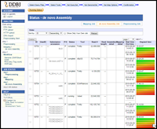

## 研究紹介

神沼英里(Eli Kaminuma)の研究用ページです。
情報科学で博士(工学)を取得後、ライフサイエンス分野で研究をしています。

専門は「ライフサイエンスAI (LifeScience AI)」です。メディア素材(テキスト、画像、音声)を用いて、自動注釈(Automatic Annotation)により表現型・遺伝子型・環境条件等の有用情報を抽出します。

理化学研究所(2001～2009)と国立遺伝学研究所(2009～)で画像自動注釈とDNA配列自動注釈を中心に、研究・教育・ソフトウェア開発でまとめた成果を下記表に挙げます。

### 開発ソフトウェア・データベース

| Tool Image   |  Tool Name 	  | Function  |　Reference/Year  | 
|---|---|---|---|
|  | DNASmartTagger |	DNA配列入力により、INSDCデータベース構造化タグ予測を行う。データバンク登録時のメタデータ自動生成と、既存未登録属性のインピューテーションを目標に、開発中。発表済タグは、PCRプライマと生態属性の高度。 | 2017 |
|  |  CrowdR&D |	クラウドソーシングを利用する国内の研究開発タスクのカタログデータベース(2016.6公開)。個人情報保護法改正2017.5に伴い、ユーザ評価機能を除いて再公開するために改修中。	| 2016 | 
|    |DDBJ Read Annotation Pipeline |DDBJ Read Annotation Pipelineは、高速DNAシークエンサ配列解析のウェブサービス。断片シーケンスからのゲノム再構築と、参照配列アライメントの基礎処理をGUI環境で提供する。遺伝研スパコン上に実装されている。|	2016,2013,2010 |
|   | DNAPod |	DNA polymorphism annotation database (DNApod)は系統間DNA多型ワークフローと統合データベース。DBには、植物のイネ・トウモロコシ・ソルガムで各679,404,66系統分の多型情報が掲載されている。SRA再解析により構築した。	|2015 |
|  |	H2DB | 	H²DB は遺伝率と多型のキュレーションデータベース。狭義と広義の遺伝率をPubmed abstractから手作業で抽出。更に、PATOオントロジ(Phenotypic Quality Ontology)を割当てて分類を可能にした。ヒト以外の生物も掲載されている。 |	2013 | 
| | 	GTASSIST |  	GTAssistは、TaqMan SNP遺伝子型アッセイの出力データのキュレーション支援ツール。カーネル法活用のMarker Ranking Measure等の遺伝子型定量評価用の2尺度を提案した。|	2008 |

その他、開発に貢献したソフトウェアは、DDBJの塩基配列登録システムNSSS（Kosuge et al., 2014）があります。

### 　開発教材　

|    | Teaching materials	  | Year 	 |　Programming language  | 
|---|---|---|---|
|1  | [機械学習ハンズオン輪読会](https://github.com/ekaminuma/MachineLearning_RC17)[Hands-On Machine Learning with Scikit-Learn and TensorFlow]  | 2017 | python, scikit-learn 　|
|2  | 機械学習コンペティション「DNA配列からのクロマチン特徴予測」：[NIGスパコンでのLDA解析事例](http://www.ddbj.nig.ac.jp/wp-content/downloads/ddbjing/ddbj-challenge2016_handson.pdf) | 2016 | MATLAB　   |
|3  | [Bioinformaticsハンズオン輪読会](https://github.com/ekaminuma/BioinfoTraining_RC15)[Bioinformatics with R Cookbook]  | 2015-2016 | R |
|4  | 一般公開用Scratch2.0プログラミング [[DNAバーコードの図を作ろう](https://scratch.mit.edu/projects/154426647/)] | 2017 | Scratch |

### 外部資金・特許・MTA  (selected) 

|Type |	Title |	Year | 	Journal papers, etc.|
|---|---|---|---|
|Patent| 	特願2017-032011 情報処理装置、情報処理方法及び情報処理プログラム	| 2017	| |
|Grant | 	早生カンキツ育種効率化のための選抜育種技術の開発とその利用(NGB2009) 農林水産省委託プロジェクト研究「多数の遺伝子が関与する形質を改良する新しい育種技術の開発」代表者: 野中圭介（清水徳朗、神沼英里)| 2016 | Minamikawa et al.,Scientific Report 2017 |
| MTA | Prof.Roose, University of California Riverside 柑橘4品種ゲノム配列：Unshiu(Satsuma), Ponkan, KingMandarin, Banpeiyu |	2015 |Affymetrix Axiom chip(56k and 1.3M) will be developed. |
|Grant | 	カンキツの育種選抜に利用可能なゲノムワイドSNPの拡充（NGB1006）農林水産省委託プロジェクト研究「多数の遺伝子が関与する形質を改良する新しい育種技術の開発」: 研究期間: 2013年7月 - 2016年3月    代表者: 清水徳朗 (神沼英里) |	2016 | Shimizu et al.,Acta Horiculturae 2016 |
| Grant | 	新型シーケンサ・アーカイブ配列を用いた植物系統SNP統合と多様性指標解析 日本学術振興会: 科研費基盤研究(C) 研究期間: 2012年4月 - 2015年3月    代表者: 神沼英里 	|2015 | Mochizuki et al.,PLoS ONE 2017 |
|Grant 	 | バイオ基幹情報資源の高準化と共用化（担当：DRAとpipeline）JST-BIRD: BIRD第２期受託事業 研究期間: 2010年4月 - 2011年3月    代表者: 菅原秀明　（宮崎智、鈴木智典、川本祥子、大久保公策、五條堀孝、中村保一、神沼英里、權娟大、猿橋智) 	|2011| Kaminuma et al., NAR 2010 |

その他、
クラウドソーシングにおける倫理的・社会的・技術的課題とその解決法の調査
研究期間: 2014年10月 - 2015年3月    代表者: 鹿島久嗣(松原繁夫、森嶋厚行、小山聡、櫻井祐子、大向 一輝、馬場雪乃、神沼英里)、
クラウドソーシングを用いたビッグデータ解析の適用分野調査
JST: CREST H25年度　特定課題調査費
研究期間: 2013年11月 - 2014年3月    代表者: 鹿島久嗣（松原繁夫、森嶋厚行、小山聡、櫻井祐子、神沼英里、馬場雪乃、王晶晶、張承成） 
